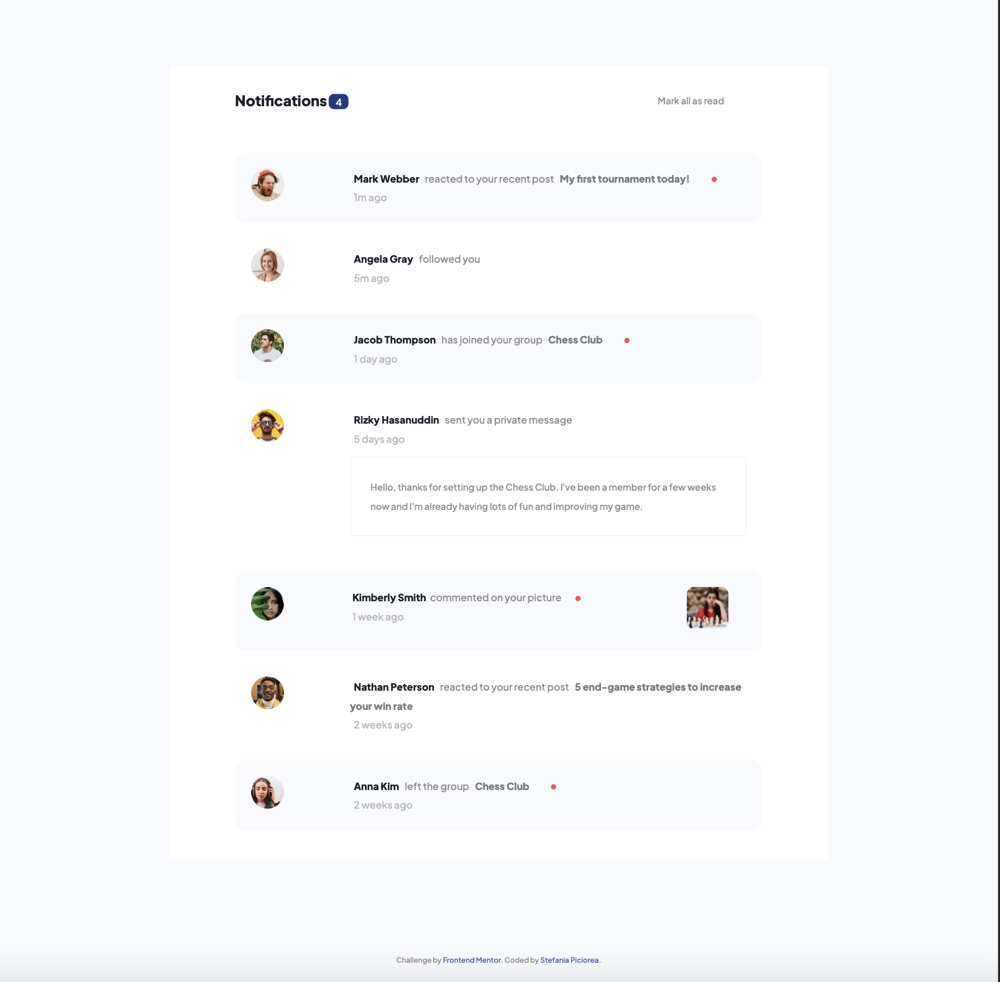
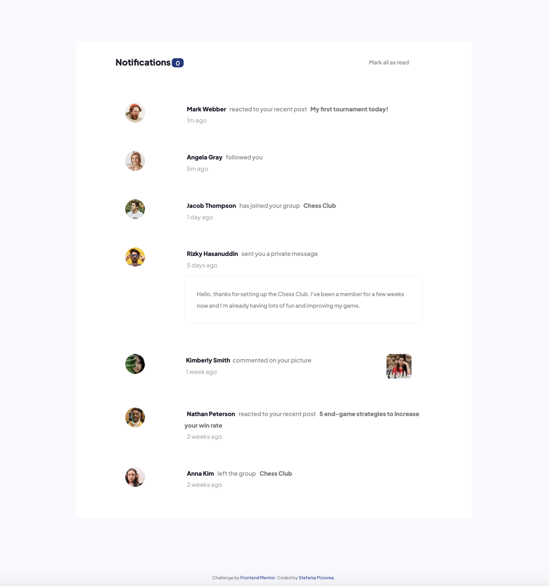
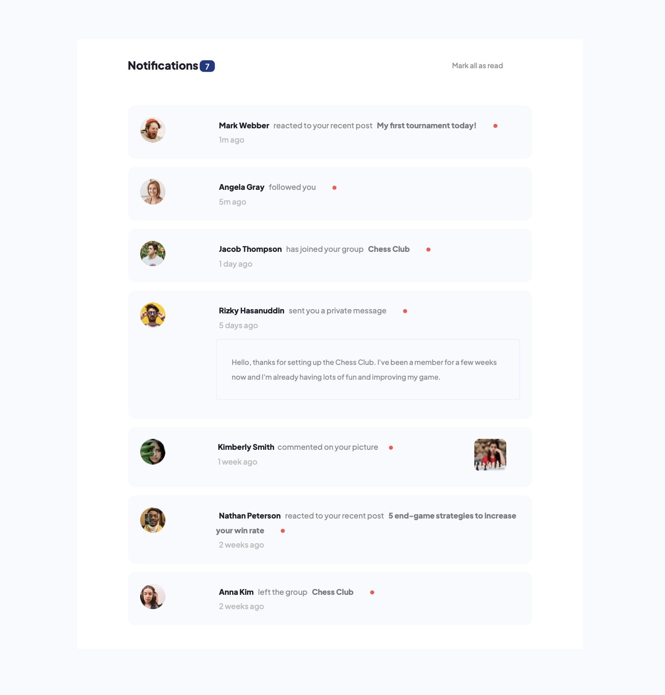
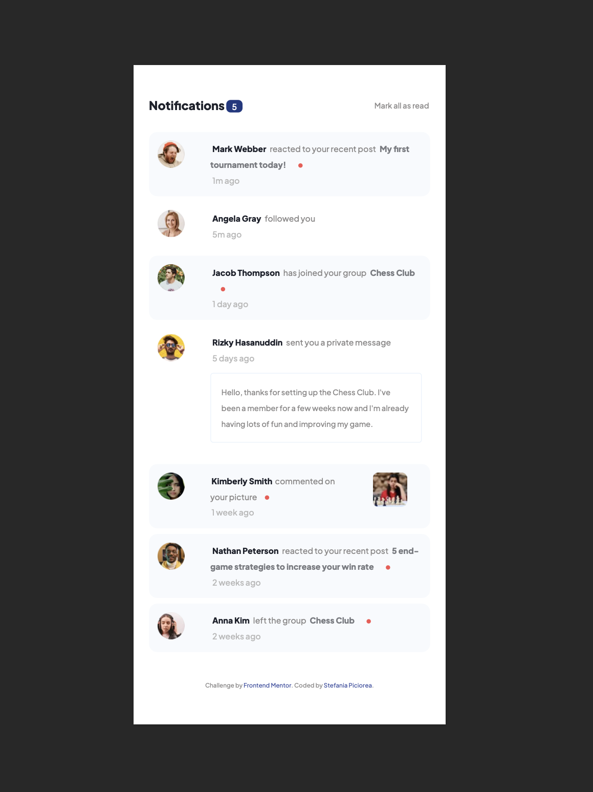
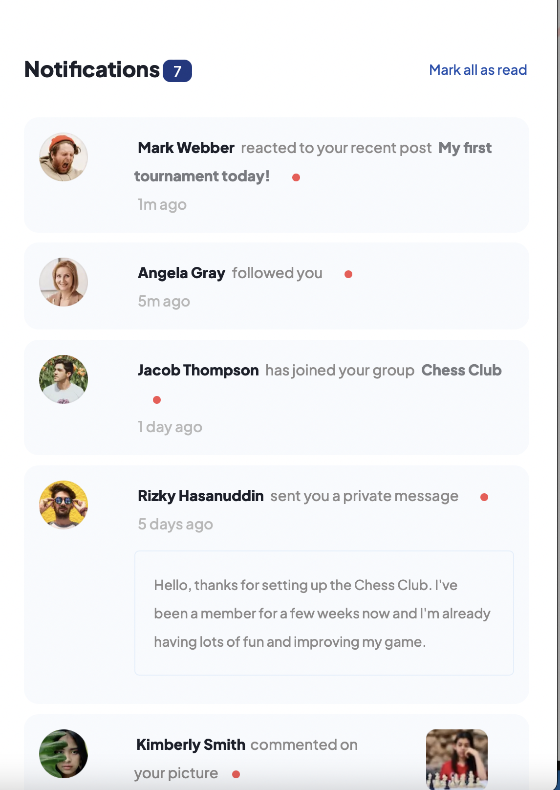
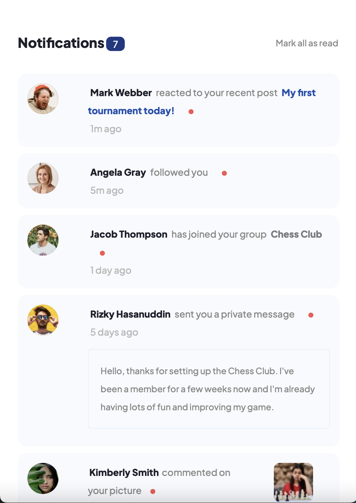
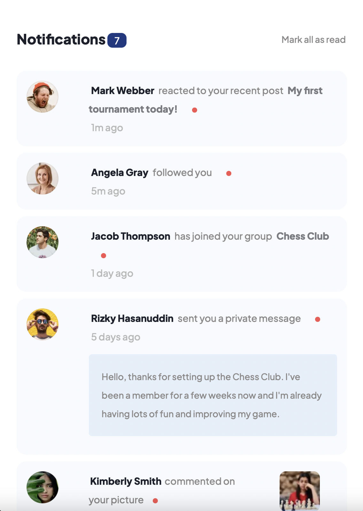

## Table of contents

- [Overview](#overview)
  - [The challenge](#the-challenge)
  - [Screenshot](#screenshot)
  - [Links](#links)
- [My process](#my-process)
  - [Built with](#built-with)
  - [What I learned](#what-i-learned)
- [Author](#author)


## Overview

### The challenge

Users should be able to:

- Distinguish between "unread" and "read" notifications
- Select "Mark all as read" to toggle the visual state of the unread notifications and set the number of unread messages to zero
- View the optimal layout for the interface depending on their device's screen size
- See hover and focus states for all interactive elements on the page

### Screenshot










### Links

- Live Site URL: [Hosted on Github Pages](https://stefania-p11.github.io/notifications-page/)

## My process

### Built with

- HTML5
- CSS
- Flexbox
- Mobile-first workflow
- JavaScript
- Media Queries

### What I learned


I learned how to create interactive web applications using JavaScript. The most challeging part about this project was adding Event Listeners on the appropriate elements and triggering an appropriate response. 

The following code targets an unread notification. Once clicked, the background changes, the red marker disappears and the Notification counter is updated to reflect the remaining unread notifications:

```js

notifications.forEach(notification => {
     notification.addEventListener('click', (e) => {
          
          notification.style.background = '#fff'
          const badge = notification.querySelector('.badge')
          badge.style.display = 'none'
         
          if (notification.classList.contains('unread')){
               let notificationCount = document.querySelector('.notificationCounter').innerText
               notificationCount--;
               e.target.classList.remove('triggerCount')
               notification.classList.remove('unread')
         
          document.querySelector('.notificationCounter').innerText = notificationCount;
     }
})

})


````


## Author

- LinkedIn - [Stefania Piciorea](https://www.linkedin.com/feed/)
- Frontend Mentor - [@Stefania-P11](https://www.frontendmentor.io/profile/Stefania-P11)

